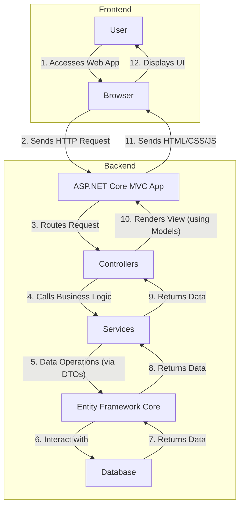

# 📦 BTH Data Center Inventory

## Streamlining Data Center Asset Management

This project, **BTH Data Center Inventory**, is a robust web-based application designed to efficiently manage and track assets within a data center environment. Built with ASP.NET Core MVC, it provides a comprehensive solution for inventory control, offering features such as category management, data center location tracking, item management (including detailed specifications, serial numbers, and purchase order info), user authentication, and powerful reporting capabilities.

The system aims to simplify inventory operations, reduce manual errors, and provide real-time insights into the status and location of critical data center assets.

---

## 📸 Screenshots


---

## 🚀 Tech Stack

The BTH Data Center Inventory system is built using a modern and powerful set of technologies:

| Category        | Technology            | Badge                                                                                                                                                                                                                                                                                                                                                             |
| :-------------- | :-------------------- | :---------------------------------------------------------------------------------------------------------------------------------------------------------------------------------------------------------------------------------------------------------------------------------------------------------------------------------------------------------------- |
| **Backend**     | C#                    |                                                                                                                                                                                                                                                                     |
|                 | ASP.NET Core MVC      |                                                                                                                                                                                                                                                 |
|                 | Entity Framework Core |                                                                                                                                                                                                                                            |
|                 | JWT Authentication    |                                                                                                                                                                                                                                                             |
| **Frontend**    | HTML                  |                                                                                                                                                                                                                                                                   |
|                 | CSS                   |                                                                                                                                                                                                                                                                     |
|                 | Tailwind CSS          |                                                                                                                                                                                                                                              |
|                 | JavaScript            |                                                                                                                                                                                                                                                      |
| **Build Tools** | .NET SDK              |                                                                                                                                                                                                                                                                    |
|                 | Node.js               |                                                                                                                                                                                                                                                             |
|                 | npm                   |                                                                                                                                                                                                                                                                         |
|                 | PostCSS               |                                                                                                                                                                                                                                                            |
|                 | Autoprefixer          |                                                                                                                                                                                                                                               |
| **Database**    | SQL Server (implied)  |                                                                                                                                                                                                                                            |

---

## ⚙️ Installation

Follow these steps to set up and run the BTH Data Center Inventory application locally.

### Prerequisites

Before you begin, ensure you have the following installed on your machine:

*   [.NET SDK](https://dotnet.microsoft.com/download) (Version 8.0 or higher recommended)
*   [Node.js](https://nodejs.org/en/download) (LTS version recommended)
*   [npm](https://www.npmjs.com/get-npm) (comes with Node.js)
*   A database server (e.g., SQL Server, PostgreSQL, SQLite, MySQL) accessible by your application.

### Steps

1.  **Clone the Repository**

    ```bash
    git clone https://github.com/adilgunawan/bth_dc_inventory.git
    cd bth_dc_inventory/bth_dc_inventory
    ```

2.  **Install Frontend Dependencies**

    Navigate into the `bth_dc_inventory` project folder and install the Node.js packages required for Tailwind CSS.

    ```bash
    npm install
    ```

3.  **Build Tailwind CSS**

    Generate the `output.css` file from your Tailwind CSS configuration.

    ```bash
    npm run css:build
    # For development with live updates:
    # npm run css:watch
    ```

4.  **Configure Database Connection**

    Open `appsettings.json` (and `appsettings.Development.json` if applicable) and update the `ConnectionStrings` section to point to your database.

    ```json
    {
      "ConnectionStrings": {
        "DefaultConnection": "Server=YOUR_SERVER_NAME;Database=BthDcInventoryDb;Trusted_Connection=True;MultipleActiveResultSets=true;TrustServerCertificate=True;"
        // Example for SQL Server, adjust as necessary for other databases
      },
      // ... other settings
    }
    ```
    **Note**: Replace `YOUR_SERVER_NAME` with your actual SQL Server instance name, or provide the full connection string details for your chosen database.

5.  **Apply Database Migrations**

    Ensure your database schema is up-to-date by applying Entity Framework Core migrations.

    ```bash
    dotnet ef database update
    ```
    If you encounter issues, ensure you are in the directory containing the `.csproj` file (`bth_dc_inventory/bth_dc_inventory`).

6.  **Run the Application**

    You can run the application using the .NET CLI:

    ```bash
    dotnet run
    ```
    Alternatively, for development with hot-reloading:

    ```bash
    dotnet watch run
    ```

    The application will typically launch on `https://localhost:7082` or `http://localhost:5164` (check the console output for the exact URL).

---

## 📁 Folder Structure

The project follows a standard ASP.NET Core MVC architecture, organized for clarity and maintainability.

```
bth_dc_inventory/
├── .gitattributes
├── .gitignore
├── bth_dc_inventory.sln             # Visual Studio Solution file
└── bth_dc_inventory/                # Main ASP.NET Core Project
    ├── .config/                     # .NET configuration files
    ├── Controllers/                 # Handles incoming HTTP requests and responses, orchestrating data flow.
    │   ├── AccountController.cs     # User authentication (Login, Register).
    │   ├── CategoryController.cs    # CRUD operations for item categories.
    │   ├── DataCenterController.cs  # Management of data center locations.
    │   ├── ItemsController.cs       # Core item/asset management (CRUD).
    │   ├── ReportsController.cs     # Logic for generating various reports.
    │   └── ...
    ├── DTOs/                        # Data Transfer Objects for clean data exchange between layers.
    │   ├── Category/                # DTOs for category-related data.
    │   ├── Common/                  # General-purpose DTOs (e.g., pagination).
    │   ├── DataCenter/              # DTOs for data center-related data.
    │   ├── Item/                    # DTOs for item-related data.
    │   ├── Report/                  # DTOs for report filters and results.
    │   └── Users/                   # DTOs for user authentication and management.
    ├── Data/                        # Database context and configuration.
    │   └── ApplicationDbContext.cs  # Entity Framework Core DbContext for database interaction.
    ├── Documents/                   # Contains logic for generating documents like invoices or custom reports.
    │   └── InvoiceDocument.cs
    ├── Helpers/                     # Utility classes and helper functions (e.g., JWT token handling).
    │   └── JwtHelper.cs
    ├── Migrations/                  # Entity Framework Core database migration files.
    ├── Models/                      # Defines the database entities and data models (POCOs).
    │   ├── Category.cs              # Model for item categories.
    │   ├── DataCenter.cs            # Model for data center locations.
    │   ├── Item.cs                  # Model for inventory items/assets.
    │   ├── ItemTransaction.cs       # Model for tracking item movements/changes.
    │   ├── User.cs                  # Model for application users.
    │   └── ...
    ├── Services/                    # Business logic and service abstractions, encapsulating core functionalities.
    │   └── ImageUploadService.cs    # Service for handling image uploads.
    ├── Views/                       # UI templates (Razor Views) for rendering dynamic web pages.
    │   ├── Account/                 # Views related to user authentication.
    │   ├── Home/                    # Public/landing page views.
    │   ├── Products/                # Main application views (Dashboard, Item details, Reports).
    │   └── Shared/                  # Reusable partial views and layout templates.
    ├── wwwroot/                     # Static files served directly by the web server.
    │   ├── css/                     # Compiled CSS files (including Tailwind's output).
    │   ├── icons/                   # SVG icons used in the UI.
    │   ├── js/                      # JavaScript files for client-side interactivity.
    │   └── ...
    ├── appsettings.json             # Application configuration settings.
    ├── bth_dc_inventory.csproj      # Project file for .NET, defines project dependencies and build settings.
    ├── package.json                 # Frontend dependencies and scripts (e.g., for Tailwind CSS).
    └── tailwind.config.js           # Configuration file for Tailwind CSS.
```

---

## 📊 Architecture Diagram

The following diagram illustrates the high-level architecture and data flow within the BTH Data Center Inventory application.


